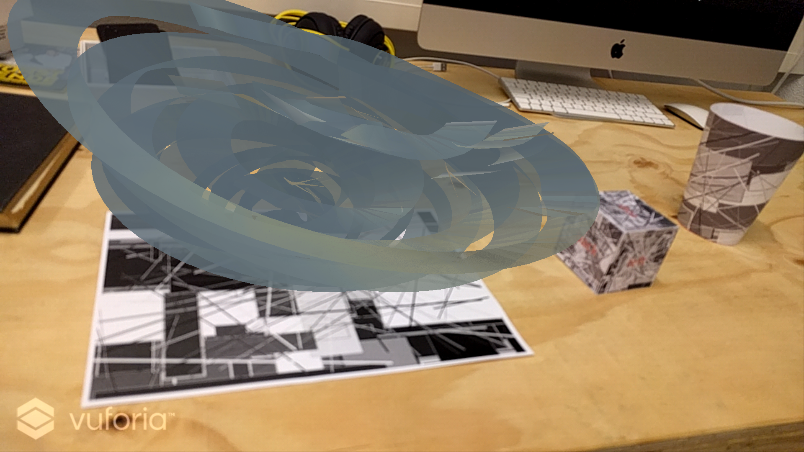
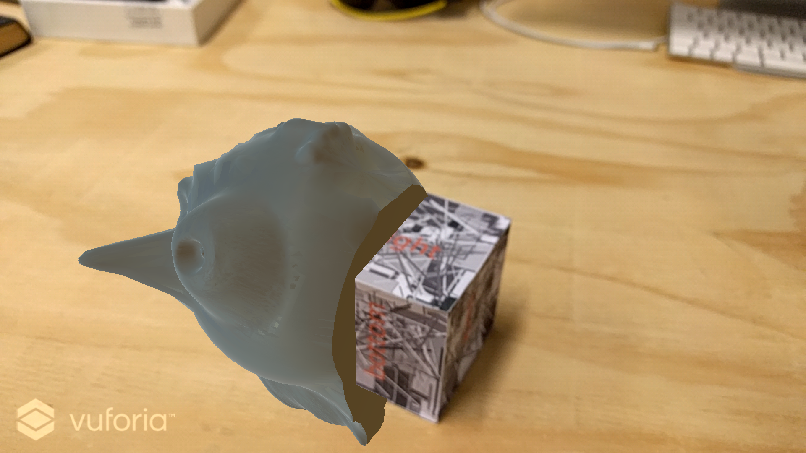
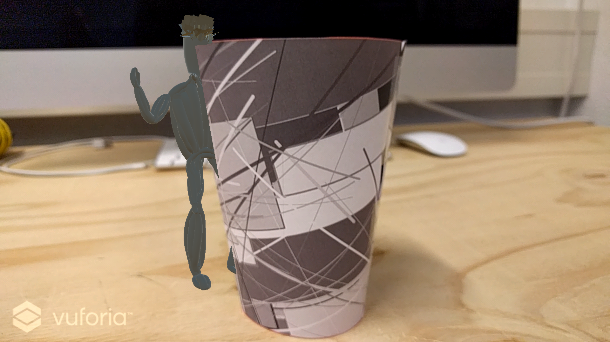
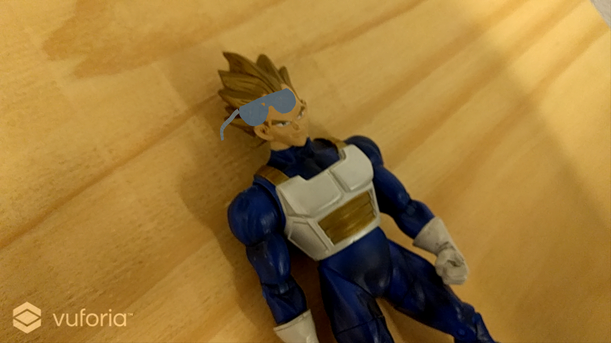

# VuforiaTest
Testing out different features of [Vuforia](http://vuforia.com) in [Unity](http://unity3d.com)

This is just an overview of what I've tested, for complete guides visit [Vuforia](https://developer.vuforia.com/support)

Vuforia is an Augmented Reality platform. That means recognise targets,  such as images or shapes, in a camera feed. Then display other images or objects on a location based on the target. The result is a live camera image with something else added (augmented) in to the world (reality).

Unity is a game engine, but I'll be using it to make an app. The reason I chose Unity and not something like Android Studio is because I'll be using this test to make an app that displays VR-made art. Specificly art made in Tilt Brush, which is very compatible with Unity (see this repository: [TiltBrushDisplay](https://github.com/thijsvb/TiltBrushDisplay)).

### Tests
I'll be trying out:

* a single image target :white_check_mark:
* a cuboid target :white_check_mark:
* a cylindrical target :white_check_mark:
* a 3d object target :white_check_mark:
* using multiple targets of all types in a single database :white_check_mark:

### Single Image

I found images with high-contrast edges work best. After uploading the target image to Vuforia, I downloaded the database.

In Unity, I imported the Vuforia package and the database package. After that I added the thing I wanted to display on top of the target and composed the scene. Then I could export it to an APK file and install it on any Android device.

### Cuboid

The process for a cuboid is very similair, but I made 6 images instead of one. In Unity I used a MultiTarget instead of an ImageTarget, but it works almost the same. Interestingly, Vuforia hides part of the model that are behind the cuboid, as you can see in the screenshot.

### Cylinder 
The cylinder can also be a (truncated) cone, as used in this example.

Once again, this was almost the same process. However, the making of the image required some more maths, since you need to figure out what shape to cut to make the shape. Here Vuforia also knows what parts of the model should be hidden.

### 3D Object

3d objects have to be scanned with Vuforia's app, more info [here](https://library.vuforia.com/articles/Training/Vuforia-Object-Scanner-Users-Guide) and [here](https://library.vuforia.com/articles/Training/Object-Recognition). [Making Google Cardboard apps with Vuforia in Unity.](https://library.vuforia.com/articles/Solution/Integrating-Cardboard-to-the-ARVR-Sample) After scanning an object with the app and uploading it, it works just like any other target. Inside Unity the 3d object is seen as another database, so you'll have to activate it separately. The only other difference is that here, Vuforia doesn't know what parts of the model should be behind the object.

